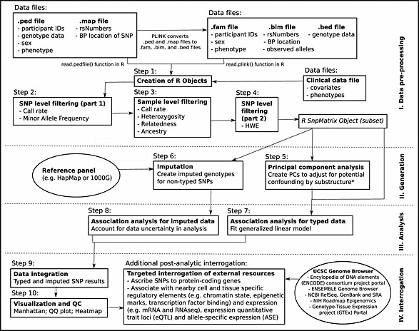

# Genome-wide Association Study Tutorial using the PennCATH data set

The materials in this tutorial have been derived from [Reed et al. (2015)](https://doi.org/10.1002/sim.6605) "A guide to genome-wide association analysis and post-analytic interrogation."

Since publication, many of the resources referenced are no longer available or have been updated. This version of the tutorial is intended for use in the EAGER program at California State University, Fullerton.

### Contents:

-   [Setup](00_setup.qmd)
-   [Data pre-processing - steps 1-4](Data-pre-processing.md)
-   [Data generation - steps 5-6](Data-generation.md)
-   [GWAS analysis - steps 7-8](GWAS-analysis.md)
-   [Post-analytic visualization and-genomic interrogation - steps 9-10](Post-analytic-visualization-and-genomic-interrogation.md)

Materials from [Reed et al. (2015)](https://doi.org/10.1002/sim.6605).

